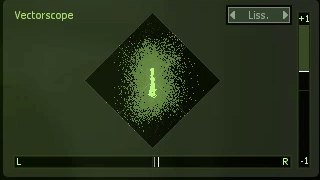
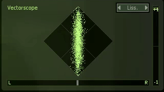
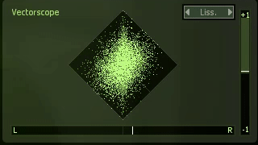
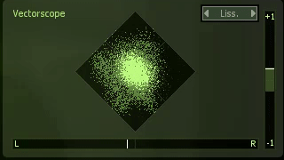
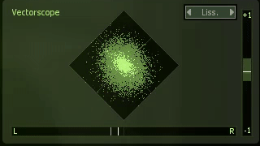

# Stereo Image Learning Representation
Codes for the paper **The Methodology for Stereo Image Learning Representation**. [[pdf](https://nbviewer.jupyter.org/github/changwoonchoi/ml2020/blob/master/paper/main.pdf)] by [Changwoon Choi](http://3d.snu.ac.kr/members/), [Seongrae Kim](), [Sangwoo Han]().

| | | | | |
|:---------:|:---------:|:---------:|:---------:|:---------:|
|Dataset|||
|Gansynth[[1]](#1)||||
|Ours|.gif)|.gif)|.gif)|


You can check the sample audio corresponding to the stereo image above at the following Google Drive link. ([link](https://drive.google.com/drive/folders/1qQzWFbp7RyZdd12YDpemjAa3GlPMXVQf?usp=sharing))
## Installation
<!---
### 1. Anaconda and environment installations
-->
To run the codebase, you need [Anaconda](https://www.anaconda.com/). Once you have Anaconda installed, run the following command to create a conda environment.
```
conda create -n ml2020 python=3.8
conda activate ml2020
pip3 install -r requirements.txt
```

## Dataset
You can download our dataset at following Google Drive link.
[[Dataset Link](https://drive.google.com/drive/folders/1RCljf5SUgpIPMjVXdYCAYO8DNnaVTWHL?usp=sharing) ] \
In the compressed file, there are raw wav files and [train.txt](./data/train.txt), [test.txt](train.txt) for train - test split.

## Train
### 1. Data preprocessing
You can get preprocessed mel-spec and IF chunks with simply run prepare_data.py in model/ directory.
```
python prepare_data.py
```
### 2. Train Network
You can easily train the network by running trian-MS.py \
(You need to modify the root directories and data directories in train-MS.py)
```
python train-MS.py
```
## Test
### 1. Sample from trained model
Run the following command from the terminal in ml2020 folder:
```
python infer.py --type MS --model MODEL_PATH --sample_num NUM_SAMPLES --save_dir PATH_TO_SAVE
```

### 2. Evaluate
If you want to evaluate your outputs, you can run the following command to get the results:
```
python test_metrics.py --gen_dir PATH_TO_YOUR_OUTPUTS
```

## License

## References
<a id="1">[1]</a>
Jesse Engel et al.,“GANSynth: Adversarial neural audio synthesis,” in International Conference on Learning Representations, 2019.
